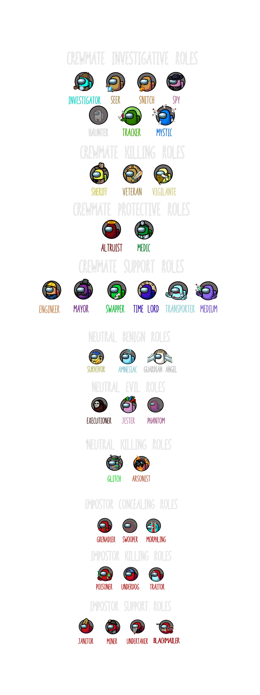

## *Note: This repository is an unofficial continuation of Town of Us due to the original repository being discontinued.*

An Among Us mod that adds a bunch of roles, modifiers and game settings

Join our [Discord](https://discord.gg/ugyc4EVUYZ) if you have any problems or want to find people to play with!

**Crewmate Roles**
- [Haunter](#haunter)
- [Investigator](#investigator)
- [Mystic](#mystic)
- [Seer](#seer)
- [Snitch](#snitch)
- [Spy](#spy)
- [Tracker](#tracker)
- [Sheriff](#sheriff)
- [Veteran](#veteran)
- [Vigilante](#vigilante)
- [Altruist](#altruist)
- [Medic](#medic)
- [Engineer](#engineer)
- [Mayor](#mayor)
- [Medium](#medium)
- [Swapper](#swapper)
- [Time Lord](#time-lord)
- [Transporter](#transporter)

**Neutral Roles**
- [Amnesiac](#amnesiac)
- [Guardian Angel](#guardian-angel)
- [Survivor](#survivor)
- [Executioner](#executioner)
- [Jester](#jester)
- [Phantom](#phantom)
- [Arsonist](#arsonist)
- [The Glitch](#the-glitch)

**Impostor Roles**
- [Grenadier](#grenadier)
- [Morphling](#morphling)
- [Swooper](#swooper)
- [Poisoner](#poisoner)
- [Traitor](#traitor)
- [Underdog](#underdog)
- [Blackmailer](#blackmailer)
- [Janitor](#janitor)
- [Miner](#miner)
- [Undertaker](#undertaker)

**Modifiers**
- [Bait](#bait)
- [Diseased](#diseased)
- [Torch](#torch)
- [Button Barry](#button-barry)
- [Drunk](#drunk)
- [Flash](#flash)
- [Giant](#giant)
- [Lovers](#lovers)
- [Sleuth](#sleuth)
- [Tiebreaker](#tiebreaker)

-----------------------
# Releases
| Among Us - Version| Mod Version | Link |
|----------|-------------|-----------------|
| 2022.3.29s & 2022.3.29e | v3.0.1 | [Download](https://github.com/eDonnes124/Town-Of-Us/releases/download/v3.0.1/ToU.v3.0.1.zip) |
| 2022.3.29s & 2022.3.29e | v3.0.0 | [Download](https://github.com/eDonnes124/Town-Of-Us/releases/download/v3.0.0/ToU.v3.0.0.zip) |
| 2021.12.15s & 2021.12.15e Until 2022.2.24s & 2022.2.24e | v2.6.5 | [Download](https://github.com/eDonnes124/Town-Of-Us/releases/download/v2.6.5/ToU.v2.6.5.zip) |
| 2021.12.15s & 2021.12.15e Until 2022.2.24s & 2022.2.24e | v2.6.4 | [Download](https://github.com/eDonnes124/Town-Of-Us/releases/download/v2.6.4/ToU.v2.6.4.zip) |
| 2021.6.30s & 2021.6.30e & 2021.7.20e | v2.6.4 | [Download](https://github.com/eDonnes124/Town-Of-Us/releases/download/v2.6.4/ToU.v2.6.4-2021.6.30.zip) |
| 2021.12.15s & 2021.12.15e Until 2022.2.24s & 2022.2.24e | v2.6.3 | [Download](https://github.com/eDonnes124/Town-Of-Us/releases/download/v2.6.3/ToU.v2.6.3.zip) |
| 2021.6.30s & 2021.6.30e & 2021.7.20e | v2.6.3 | [Download](https://github.com/eDonnes124/Town-Of-Us/releases/download/v2.6.3/ToU.v2.6.3-2021.6.30.zip) |
| 2021.12.15s & 2021.12.15e Until 2022.2.24s & 2022.2.24e | v2.6.2 | [Download](https://github.com/eDonnes124/Town-Of-Us/releases/download/v2.6.2/ToU.v2.6.2.zip) |
| 2021.6.30s & 2021.6.30e & 2021.7.20e | v2.6.2 | [Download](https://github.com/eDonnes124/Town-Of-Us/releases/download/v2.6.2/ToU.v2.6.2-2021.6.30.zip) |
| 2021.12.15s & 2021.12.15e Until 2022.2.24s & 2022.2.24e | v2.6.1 | [Download](https://github.com/eDonnes124/Town-Of-Us/releases/download/v2.6.1/ToU.v2.6.1.zip) |
| 2021.6.30s & 2021.6.30e & 2021.7.20e | v2.6.1 | [Download](https://github.com/eDonnes124/Town-Of-Us/releases/download/v2.6.1/ToU.v2.6.1.Old.zip) |
| 2021.12.15s & 2021.12.15e Until 2022.2.24s & 2022.2.24e | v2.6.0 | [Download](https://github.com/eDonnes124/Town-Of-Us/releases/download/v2.6.0/ToU.v2.6.0.zip) |
| 2021.6.30s & 2021.6.30e & 2021.7.20e | v2.6.0 | [Download](https://github.com/eDonnes124/Town-Of-Us/releases/download/v2.6.0/ToU.v2.6.0.Old.zip) |
| 2021.12.15s & 2021.12.15e Until 2022.2.24s & 2022.2.24e | v2.5.1 | [Download](https://github.com/eDonnes124/Town-Of-Us/releases/download/v2.5.1/ToU.v2.5.1.zip) |
| 2021.12.15s & 2021.12.15e Until 2022.2.24s & 2022.2.24e | v2.5.0 | [Download](https://github.com/eDonnes124/Town-Of-Us/releases/download/v2.5.0/ToU.v2.5.0.zip) |
| 2021.6.30s & 2021.6.30e & 2021.7.20e | v2.5.0 | [Download](https://github.com/eDonnes124/Town-Of-Us/releases/download/v2.5.0/ToU.v2.5.0.Old.zip) |
| 2021.12.15s & 2021.12.15e Until 2022.2.24s & 2022.2.24e | v2.4.2 | [Download](https://github.com/eDonnes124/Town-Of-Us/releases/download/v2.4.2/ToU.v2.4.2.zip) |
| 2021.12.15s & 2021.12.15e Until 2022.2.24s & 2022.2.24e | v2.4.1 | [Download](https://github.com/eDonnes124/Town-Of-Us/releases/download/v2.4.1/ToU.v2.4.1.zip) |
| 2021.11.9.5s & 2021.11.9.5e | v2.4.0 | [Download](https://github.com/eDonnes124/Town-Of-Us/releases/download/v2.4.0/ToU.v2.4.0.zip) |
| 2021.6.30s & 2021.6.30e & 2021.7.20e | v2.3.4 | [Download](https://github.com/eDonnes124/Town-Of-Us/releases/download/v2.3.4/ToU.v2.3.4.zip) |
| 2021.6.30s & 2021.6.30e & 2021.7.20e | v2.3.3 | [Download](https://github.com/eDonnes124/Town-Of-Us/releases/download/v2.3.3/ToU.v2.3.3.zip) |
| 2021.6.30s & 2021.6.30e & 2021.7.20e | v2.3.2 | [Download](https://github.com/eDonnes124/Town-Of-Us/releases/download/v2.3.2/ToU.v2.3.2.zip) |
| 2021.6.30s & 2021.6.30e & 2021.7.20e | v2.3.1 | [Download](https://github.com/eDonnes124/Town-Of-Us/releases/download/v2.3.1/ToU.v2.3.1.zip) |
| 2021.6.30s & 2021.6.30e & 2021.7.20e | v2.3.0 | [Download](https://github.com/eDonnes124/Town-Of-Us/releases/download/v2.3.0/ToU.v2.3.0.zip) |
| 2021.6.30s & 2021.6.30e & 2021.7.20e | v2.2.1 | [Download](https://github.com/polusgg/Town-Of-Us/releases/download/v2.2.1/TOU_221.zip) |
| 2021.6.30s & 2021.6.30e & 2021.7.20e | v2.2.0 | [Download](https://github.com/polusgg/Town-Of-Us/releases/download/v2.2.0/TOU_220.zip) |
| 2021.6.15s & 2021.6.15e | v2.1.4 | [Download](https://github.com/polusgg/Town-Of-Us/releases/download/v2.1.4/TOU_214.zip) |
| 2021.6.15s & 2021.6.15e | v2.1.3 | [Download](https://github.com/polusgg/Town-Of-Us/releases/download/v2.1.3/TownOfUs213_1.zip) |
| 2021.6.15s & 2021.6.15e | v2.1.2 | [Download](https://github.com/polusgg/Town-Of-Us/releases/download/v2.1.2/TownOfUs212_1.zip) |
| 2021.6.15s & 2021.6.15e | v2.1.1 | [Download](https://github.com/polusgg/Town-Of-Us/releases/download/v2.1.1/TownOfUs211_1.zip) |
| 2021.5.10s | v2.0.4 | [Download](https://github.com/polusgg/Town-Of-Us/releases/download/v2.0.4/TownOfUs-v2.0.4.zip) |
| 2021.5.10s | v2.0.3 | [Download](https://github.com/polusgg/Town-Of-Us/releases/download/v2.0.3/TownOfUs-v2.0.3.zip) |
| 2021.4.12s & 2021.4.14s | v2.0.2 | [Download](https://github.com/polusgg/Town-Of-Us/releases/download/v2.0.2/TownOfUs-v2.0.2.zip) |
| 2021.4.12s | v2.0.1 | [Download](https://github.com/polusgg/Town-Of-Us/releases/download/v2.0.1/TownOfUs-v2.0.1.zip) |
| 2021.3.31.3s | v2.0.0 | [Download](https://github.com/polusgg/Town-Of-Us/releases/download/v2.0.0/TownOfUs-v2.0.0.zip) |
| 2021.3.5s | v1.2.0 | [Download](https://github.com/polusgg/Town-Of-Us/releases/download/v1.2.0/TownOfUs-v1.2.0.zip) |
| 2021.3.5s | v1.1.0 | [Download](https://github.com/polusgg/Town-Of-Us/releases/download/v1.1.0/TownOfUs-v1.1.0-2021.3.5s.zip) |
| 2020.12.19s | v1.1.0 | [Download](https://github.com/polusgg/Town-Of-Us/releases/download/v1.1.0/TownOfUs-v1.1.0-2020.12.9s.zip) |
| 2020.12.19s | v1.0.3 | [Download](https://github.com/polusgg/Town-Of-Us/releases/download/v1.0.3/TownOfUs-v1.0.3.zip) |
| 2020.12.19s | v1.0.2 | [Download](https://github.com/polusgg/Town-Of-Us/releases/download/v1.0.2/TownOfUs-v1.0.2.zip) |
| 2020.12.19s | v1.0.1 | [Download](https://github.com/polusgg/Town-Of-Us/releases/download/v1.0.1/TownOfUs-v1.0.1.zip) |
| 2020.12.19s | v1.0.0 | [Download](https://github.com/polusgg/Town-Of-Us/releases/download/v1.0.0/TownOfUs-v1.0.0.zip) |

  
 Changelog 

  

  
 v3.0.1 

  <ul> <li>Bug Fix: All the flashes on screen now work again</li> </ul>
  <ul> <li>Bug Fix: Amnesiac turned Sheriff/Glitch/Impostor now has a kill button again</li> </ul>
  <ul> <li>Bug Fix: The kill button now has the word 'Kill' on it again</li> </ul>
  <ul> <li>Bug Fix: The Blackmailer's blackmail button will now not always show active even when not near someone</li> </ul>
  <ul> <li>Blackmailer now only has an initial cooldown, meaning the cooldown doesn't reset after a use now</li> </ul>
  

  

  
 v3.0.0 

  <ul> <li>New Role: Medium</li> </ul>
  <ul> <li>New Role: Survivor</li> </ul>
  <ul> <li>New Role: Guardian Angel</li> </ul>
  <ul> <li>New Role: Blackmailer</li> </ul>
  <ul> <li>New Role: Mystic</li> </ul>
  <ul> <li>Camouflager removed</li> </ul>
  <ul> <li>New Settings for Vigilante to kill each type of Neutral role</li> </ul>
  <ul> <li>New Settings for Assassins to kill each type of Neutral role</li> </ul>
  <ul> <li>Bug Fix: Executioner will always get a target unless there is no feasible target</li> </ul>
  <ul> <li>Bug Fix: Executioner will always win when their target is voted out</li> </ul>
  <ul> <li>The future Phantom, Haunter and Traitor will change depending on the current circumstances</li> </ul>
  <ul> <li>Bug Fix: Abilities can no longer be used while loading into a game</li> </ul>
  <ul> <li>Added an option to cycle backwards for Assassins and Vigilante</li> </ul>
  

  

  
 v2.6.5 

  <ul> <li>Fixed Amnesiac remembering Poisoner interaction</li> </ul>
  <ul> <li>Fixed Button Barry not working during sabotages</li> </ul>
  <ul> <li>Fixed Poisoner interactions against Medic shields and Veteran alerts</li> </ul>
  <ul> <li>Transporting now works a little differently</li> </ul>
  <ul> <li>If a player is transported when they are in a position out of bounds while on something like a ladder, it rejects the transport</li> </ul>
  <ul> <li>Glitch and Transporter can now be lovers</li> </ul>
  

  

  
 v2.6.4 

  <ul> <li>Fixed Transporter bugging out after transporting a dead body</li> </ul>
  <ul> <li>Reduced Tracker arrow lag</li> </ul>
  <ul> <li>Fixed bug with Swapper where you wouldn't appear as dead after being assassinated with your swap targets already selected</li> </ul>
  <ul> <li>Fixed Medic shield not protecting the target from impostors if the Shield Breaks option is off</li> </ul>
  <ul> <li>Fixed Medic reports saying the wrong color if the body's killer was morphed</li> </ul>
  <ul> <li>Fixed Investigator showing a morphed player's footprints as the color of the player they were morphed into</li> </ul>
  <ul> <li>Ghosts no longer briefly appear after a player dies</li> </ul>
  

  

  
 v2.6.3 

  <ul> <li>Fixed the bug where games don't end (Sorry about that)</li> </ul>
  <ul> <li>Fixed Bait not causing a self-report sometimes</li> </ul>
  <ul> <li>Fixed Amnesiac turned Impostor not being able to kill</li> </ul>
  <ul> <li>Fixed Traitor not being able to kill</li> </ul>
  <ul> <li>Fixed Impostors not being able to kill a player revived by an Altruist</li> </ul>
  <ul> <li>Fixed Flash and Giant not appearing to move at the correct speed for other players</li> </ul>
  <ul> <li>Changed Giant and Flash colors</li> </ul>
  <ul> <li>Split Classic Nameplates setting into Disable Level Icon and Disable Background Cosmetics</li> </ul>
  

  

  
 v2.6.2 

  <ul> <li>Fixed End Game Tracker Bug</li> </ul>
  <ul> <li>Fixed Snitch Arrows</li> </ul>
  <ul> <li>Added Olive Colour</li> </ul>
  <ul> <li>Dead bodies are now removed after meetings</li> </ul>
  <ul> <li>Added an option for Amnesiac Arrows</li> </ul>
  <ul> <li>Fixed the issue where if a player is transported as they jump in a vent they are freezed in place</li> </ul>
  

  

  
 v2.6.1 

  <ul> <li>Fixed Poisoner killing Bait after another report resulting in a duplicated meeting</li> </ul>
  <ul> <li>Fixed the issue where the Snitch spawning as Crewmate would see their name gold</li> </ul>
  <ul> <li>Fixed Amnesiac remembering Transporter becoming an Impostor</li> </ul>
  <ul> <li>Fixed Tracker Arrows</li> </ul>
  

  

  
 v2.6.0 

  <ul> <li>Fixed killing the Bait instantly banning everyone</li> </ul>
  <ul> <li>Fixed Tracker lag</li> </ul>
  <ul> <li>Seer adjustments</li> </ul>
  <ul> <li>Settings for task tracking</li> </ul>
  <ul> <li>Added a flash radius setting for Grenadier</li> </ul>
  <ul> <li>New Role: Traitor</li> </ul>
  <ul> <li>New Role: Transporter</li> </ul>
  <ul> <li>New Modifier: Sleuth</li> </ul>
  <ul> <li>Fixed Snitch/Haunter meetings when someone disconnects</li> </ul>
  <ul> <li>Fixed Amnesiac/Snitch and Amnesiac/Mayor interactions</li> </ul>
  <ul> <li>Jester can vent Setting</li> </ul>
  <ul> <li>Made Modifiers disable upon death</li> </ul>
  <ul> <li>Made anything that affects the colour of names disable upon death</li> </ul>
  

  

  
 v2.5.1 

  <ul> <li>Fixed Amnesiac/Impostor Interaction</li> </ul>
  

  

  
 v2.5.0 

  <ul> <li>Changed Lovers to a Modifier</li> </ul>
  <ul> <li>Added Loving Impostor Percentage Setting</li> </ul>
  <ul> <li>Added Neutral Lover Setting</li> </ul>
  <ul> <li>Changed Assassin from a Role to a Default Ability</li> </ul>
  <ul> <li>New Role: Amnesiac (replacing Shifter)</li> </ul>
  <ul> <li>New Role: Veteran</li> </ul>
  <ul> <li>New Role: Poisoner</li> </ul>
  <ul> <li>New Role: Tracker</li> </ul>
  <ul> <li>New Modifier: Bait</li> </ul>
  <ul> <li>Renamed Retributionist to Vigilante</li> </ul>
  <ul> <li>End Game Summary Added</li> </ul>
  <ul> <li>In Game Task Tracking Added</li> </ul>
  

  

  
 v2.4.2 

  <ul> <li>New Hats</li> </ul>
  <ul> <li>Bug Fix for Mayor Abstain Button</li> </ul>
  <ul> <li>Readded the Missing Modstamp</li> </ul>
  

  

  
 v2.4.1 

  <ul> <li>Support for the new version of Among Us on v2021.12.15</li> </ul>
  

  

  
 v2.4.0 

  <ul> <li>Support for the new version of Among Us on v2021.11.9.5</li> </ul>
  

  

  
 v2.3.4 

  <ul> <li>Reverted the change made to Mayor as it had an unintended concequence for Assassin and Retributionist</li> </ul>
  

  

  
 v2.3.3 

  <ul> <li>Added the remaining hats with credits from ToU v2.2.1-t</li> </ul>
  <ul> <li>Added some new hats from Pigoletto</li> </ul>
  <ul> <li>Removed Acron’s hats as he requested their removal</li> </ul>
  <ul> <li>Bug Fix: Lovers no longer win if the other disconnects</li> </ul>
  <ul> <li>Bug Fix: Mayor votes no longer double on a disconnect</li> </ul>
  <ul> <li>Bug Fix: When Shifter shifts with Arsonist, the douse also shifts now</li> </ul>
  <ul> <li>Bug Fix: Shifter can now ignite after shifting with the Arsonist</li> </ul>
  <ul> <li>Bug Fix: Impostors no longer see their teammate’s name go pink at the end of the meeting if their teammate is a Loving Impostor</li> </ul>
  <ul> <li>Bug Fix: Investigator no longer lags the player into oblivion</li> </ul>
  <ul> <li>Bug Fix: The game no longer infinitely tries to distribute crewmate modifiers when there are more modifiers than crewmates</li> </ul>
  <ul> <li>Bug Fix: Shield now breaks when Medic disconnects</li> </ul>
  

  

  
 v2.3.2 

  <ul> <li>Bug Fix: Sheriff no longer instantly ends the game and bans the host for hacking</li> </ul>
  <ul> <li>Bug Fix: Retributionist/Mayor interaction</li> </ul>
  <ul> <li>Bug Fix: Executioner always gets a target now</li> </ul>
  <ul> <li>Executioner can not have Lovers, Swapper, Mayor or Retributionist as their target</li> </ul>
  <ul> <li>Made it so dead Impostors don’t see Haunter arrows</li> </ul>
  <ul> <li>Made it so if Haunter reveals Neutral roles, all Neutral roles are alerted when Haunter is nearly finished tasks</li> </ul>
  <ul> <li>Removed alert for Phantom</li> </ul>
  <ul> <li>All hats with credits from v2.2.1-t have been added</li> </ul>
  <ul> <li>Removed the settings about when Phantom/Haunter can be clicked and replaced them with ‘tasks remaining when they can be clicked’</li> </ul>
  <ul> <li>Removed the settings for Phantom/Haunter to have less tasks</li> </ul>
  <ul> <li>Changed kill cooldown bonus for Underdog from 2.5-10secs to 2.5-30secs</li> </ul>
  

  

  
 v2.3.1 

  <ul> <li>Removed Modded Handshake as that was causing the host to crash</li> </ul>
  <ul> <li>Minor Bug Fixes</li> </ul>
  

  

  
 v2.3.0 

  <ul> <li>New Role: Retributionist (Assassin Crewmate)</li> </ul>
  <ul> <li>New Role: Haunter (basically the Phantom but a Crewmate, once tasks are finished Impostors are revealed)</li> </ul>
  <ul> <li>New Role: Grenadier (blinds Crewmates with flashbangs)</li> </ul>
  <ul> <li>Added the remaining missing hats from v2.0.4 and prior</li> </ul>
  <ul> <li>Glitch cooldowns adjusted to be the same as other roles</li> </ul>
  <ul> <li>Made Swapper able to get Button Barry Modifier</li> </ul>
  <ul> <li>Button Barry vision no longer reduced after Button Barry ability was used</li> </ul>
  <ul> <li>Standardised starting cooldowns to not be decreased (for round start only) for all roles</li> </ul>
  <ul> <li>Added alert for when Phantom is nearly finished</li> </ul>
  <ul> <li>Glitch does not get notification for Snitch unless Snitch sees neutral roles</li> </ul>
  <ul> <li>Made it so Impostors know when Snitch is done all tasks</li> </ul>
  <ul> <li>Reworked how Phantom is set because of Haunter addition</li> </ul>
  <ul> <li>Gray colour changed to ‘Darker’ for Medic reports</li> </ul>
  <ul> <li>Made the Seer unable to see through the disguises of Morphling and Glitch</li> </ul>
  <ul> <li>Split shifter into two settings, who can Shifter shift on and what shifted becomes</li> </ul>
  <ul> <li>Setting for Sheriff can kill Executioner</li> </ul>
  <ul> <li>Setting for Morphling, Swooper, Undertaker and Glitch to vent</li> </ul>
  <ul> <li>Setting for Undertaker to vent while dragging a body</li> </ul>
  <ul> <li>Setting for Mayor, Swapper, Jester, Executioner and Arsonist to not be able to button</li> </ul>
  <ul> <li>Setting for Executioner becomes Shifter on target death</li> </ul>
  <ul> <li>Setting for Phantom to do less tasks</li> </ul>
  <ul> <li>Setting for Assassin to assassinate Snitch via ‘Crewmate’ guess</li> </ul>
  <ul> <li>Underdog changes: Setting to choose kill cooldown bonus</li> </ul>
  <ul> <li>Setting for Underdog to not have increased kill cooldown when 2+ imps</li> </ul>
  <ul> <li>Settings for the Phantom to not be clickable before and after alert</li> </ul>
  <ul> <li>Setting for Shifter to win with Crewmates</li> </ul>
  <ul> <li>Setting for starting cooldowns on game start for all roles (a general setting)</li> </ul>
  <ul> <li>Setting for when Snitch is revealed</li> </ul>
  <ul> <li>Settings for clicking Phantom, one for before alert and the other for after alert</li> </ul>
  <ul> <li>Setting for Snitch to not see Impostor names mid-meeting</li> </ul>
  <ul> <li>Time Lord rewind time decreased from 3-15secs to 2-5secs</li> </ul>
  <ul> <li>Time Lord cooldown increased from 10-40secs to 10-60secs</li> </ul>
  <ul> <li>The maximum number of kills an Assassin can do during a meeting increased from 1-5 to 1-15</li> </ul>
  <ul> <li>Bug Fix: Host no longer sees Undertaker dragging a body after they dropped it</li> </ul>
  <ul> <li>Bug Fix: Host now has correct cooldowns on game start</li> </ul>
  <ul> <li>Bug Fix: Investigator footprint interval fixed (lag not entirely fixed)</li> </ul>
  <ul> <li>Bug Fix: Fixed the issue where Torch/Diseased were not given to anyone</li> </ul>
  <ul> <li>Bug Fix: Made it so the Phantom only has to upload data and not download it</li> </ul>
  <ul> <li>Bug Fix: Phantom no longer spawns in the admin vent</li> </ul>
  

  

  
 v2.2.1 

  <ul> <li>Fix for the credits removed in v2.0.3 </li> </ul>
  

  

  
 v2.2.0 

  <ul> <li> Compatibility for v2021.6.30 </li> </ul>
  <ul> <li> Role percentages now change by 10%, or 5% if you hold shift </li> </ul>
  <ul> <li> New Drag/Drop Buttons for the Undertaker </li> </ul>
  <ul> <li> New Button Image for the Button Barry </li> </ul>
  <ul> <li> Phantom can't switch between vents </li> </ul>
  <ul> <li> Increased Max Cooldown for the Shifter to 60s </li> </ul>
  <ul> <li> Swapper can no longer get the Button Barry Modifier </li> </ul>
  <ul> <li> Glitch can no longer get the Button Barry Modifier </li> </ul>
  <ul> <li> Mayor votes are refunded if the player disconnects </li> </ul>
  <ul> <li> Mayor votes are refunded if the player is killed by the assassin </li> </ul>
  <ul> <li> Handshake refactor </li> </ul>
  <ul> <li> Fix for the Crashing Issues </li> </ul>
  <ul> <li> Fix for the Interaction Shifter/Giant </li> </ul>
  <ul> <li> Fix for the Interaction Shifter/Engineer </li> </ul>    
  <ul> <li> Fix for the Interaction Glitch/Jester </li> </ul>
  <ul> <li> Fix for the Interaction Morphling/Giant </li> </ul>
  <ul> <li> Fix for the Altruist Body Issues </li> </ul>
  <ul> <li> Fix for the Assassin DC Issues </li> </ul>
  <ul> <li> Fix for the Executioner Spawn Issues </li> </ul>
  <ul> <li> Fix for the Phantom Vent Spawn Issues </li> </ul>    
  <ul> <li> Fix for the Phantom Walking Through Walls Issues </li> </ul>
  <ul> <li> Fix for the Phantom Doors Issues </li> </ul>
  <ul> <li> Fix for the Phantom Tasks Issues </li> </ul>
  <ul> <li> Fix for the Swooper Invisible Issues </li> </ul>    
  <ul> <li> Fix for the Time Lord Flashing Ability Issues </li> </ul>
  <ul> <li> Fix for the Time Lord Rewind Vent Issues </li> </ul>
  <ul> <li> Fix for the Undertaker Dragging Issues </li> </ul>    
  <ul> <li> Fix for the Underdog Cooldown Issues </li> </ul>
  <ul> <li> Fix for the Giant Modifier Size Issues </li> </ul>
  <ul> <li> Fix for the State Of Dead/DC Bodies In Meeting Issues </li> </ul>   
  <ul> <li> Fix for the Voting Visual Issues </li> </ul>      
  <ul> <li> Minor enhancements and bug fixes </li> </ul>
 

  

  
 v2.1.4 

  <ul> <li> New Role (Phantom, Undertaker, Underdog) </li> </ul>
  <ul> <li> Custom Color </li> </ul>
  <ul> <li> Hats </li> </ul>
  <ul> <li> Fix for launching issues </li> </ul>
  <ul> <li> Fix for the Voting issues </li> </ul>
  <ul> <li> Fix for the disconnect issue</li> </ul>
  <ul> <li> Fix for the username placement </li> </ul>
  <ul> <li> Fix for the Medic  </li> </ul>
  <ul> <li> Fix for the Spy </li> </ul>
  <ul> <li> Fix for the Mayor </li> </ul>
  <ul> <li> Fix for the Arsonist </li> </ul>
  <ul> <li> Fix for the Assassin </li> </ul>
  <ul> <li> Fix for the Phantom </li> </ul>
  <ul> <li> Modded Handshake </li> </ul>
  <ul> <li> Child is removed </li> </ul>
  <ul> <li> Minor enhancements and bug fixes </li> </ul>
 

 

  
 v2.1.3 

  <ul> <li> Fix the launch issue </li> </ul>
  <ul> <li> Fix for the swooper role </li> </ul>
  <ul> <li> Fix for the janitor role </li> </ul>
  <ul> <li> Minor enhancements and bug fixes </li> </ul>
 

 

  
 v2.1.2 

  <ul> <li> Crucial bug fixes </li> </ul>
 

 

  
 v2.1.1 

  <ul> <li> 2021.6.15 support, Epic Games compatibility and Assassin Role </li> </ul>
 

  

  
 v2.0.4 

  <ul> <li> Crucial bug fixes </li> </ul>
 

 

  
 v2.0.3 

  <ul> <li> 2021.5.10s support </li> </ul>
 

 

  
 v2.0.2 

  <ul> <li> 2021.4.14s support and temporary auth fixes </li> </ul>
 

 

  
 v2.0.1 

  <ul> <li> 2021.4.12s support </li> </ul>
 

 

  
 v2.0.0 

  <ul>
   <li> Airship support! </li>
   <li> New role - Altruist </li>
   <li> New modifiers - Giant & Button Barry </li>
   <li> Airship comms fix built-in </li>
   <li> Bug fixes with Lovers, Time Lord etc. </li>
   <li> New hats based on streamers! </li>
   <li> Investigator cannot spawn on airship due to too much lag with handling footprints </li>
  </ul>
 

  
 

  
 v1.2.0 

  <ul>
    <li> New roles (see above)</a>
    <li> New modifiers (see above)</li>
    <li> Exporting and Importing game settings which sync between versions 1.2.0 and future versions</li>
    <li> Disconnect fix </li>
    <li> Mayor additions - Abstain button, Option for Mayor's extra votes to be anonymous </li>
    <li> Option for dead to see the roles of everyone </li>
    <li> Custom colours now work! </li>
  </ul>
 

 

  
 v1.1.0 

  <ul>
    <li> New roles (see above)</a>
    <li> New modifiers (see above)</li>
    <li> The Engineer has been changed to the <a href="https://github.com/NotHunter101/ExtraRolesAmongUs">ExtraRoles</a> version </li>
    <li> Backend overhaul! This will make it easier to add new roles </li>
    <li> New Button Art! </li>
    <li> Maps and Impostor Count can be changed from the Lobby! </li>
    <li> Shadows for the Custom Colours </li>
    <li> Fixes </li>
    <ul>
      <li> The Jester and The Shifter unable to fix Sabotages </li>
      <li> The Time Lord's Rewind not auto-force closing tasks </li>
      <li> The Q button not working for Sheriff </li>
      <li> The Shifter's Shift looking too much like a Kill </li>
      <li> Changing colours would render you weirdly green in normal Among Us </li>
    </ul>
  </ul>
  

  

  
 v1.0.3 

  
 Fixes: 

  <ul>
    <li> Engineer being able to Fix every sabotage </li>
    <li> The Investigator being able to revive people voted out (and instead made it an option) </li>
    <li> Footprints not appearing if a person walks over old footprints </li>
    <li> Graphical glitch where Jester and Lovers simultaneously win </li>
    <li> Players spawning back into positions from the last game when time is rewound right at the beginning of a new game </li>
    <li> Graphical Bug of Time Lord's name not being blue in Meetings </li>
    <li> Fixed Medbay Scan not working for custom colours </li>
  </ul>
  

  

  
 v1.0.2 

  
 Fixes: 

  <ul>
    <li>  The Swapper being unable to vote </li>
    Swapper unable to vote
    <li> Mayor Vote Bank ending up negative </li>
    <li> Anonymous Voting not working when Mayor is in a game </li>
    <li> Chats not working in the lobby </li>
    <li> Sheriff desync (I think) </li>
    <li> Buttons being able to be used during meetings </li>
  </ul>
  

  

  

  
 v1.0.1 

  
 Fixes errors of not being able to launch. 

  

-----------------------
# Installation
## Requirements 
- Among Us
- Steam or Epic Games

## Installation Guide (Steam)
**1. [Download](#releases) the Town of Us version corresponding to the installed Among Us version.**\
\
**2. Go to your Steam library.**\
\
**3. Right-click Among Us > click `Manage` > click `Browse local files`.**\
\
**4. In the File Explorer, delete the entire `Among Us` folder.**\
\
**5. Go back to your Steam library.**\
\
**6. Right-Click Among Us > click `Properties...` > click `LOCAL FILES`.**\
\
**7. Click on `VERIFY INTEGRITY OF GAME FILES...`.**\
\
**8. Wait for Steam to download a clean version of Among Us.**\
\
**9. Duplicate the new Among Us Folder.**\
\
**10. Rename it to `Among Us - ToU`.**\
\
**11. Double-click on the zip file you downloaded.**\
\
**12. Drag all the files from the zip file in the new ToU folder.**\
\
**13. Finally, launch `Among Us.exe` from that folder.**\
\
A first launch may take up to 5 minutes, so be patient if it doesn't launch immediately. 
 

## Installation Guide (Epic Games)
**1. [Download](#releases) the Town of Us version corresponding to the installed Among Us version.**\
\
**2. Go to your Epic Games library.**\
\
**3. Find Among Us and click on the 3 dots `...` > click `Uninstall`.**\
\
**4. Confirm you want to Uninstall Among Us.**\
\
**5. In the Epic library, click on Among Us to install.**\
\
**6. Copy the Folder Path.**\
\
**7. Uncheck Auto-Update.**\
\
**8. Click on Install.**\
\
**9. Click Yes on the Windows popup.**\
\
**10. Paste the folder path in Windows search bar.**\
\
**11. Click on Enter.**\
\
**12. Copy or move the contents of the Town Of Us zip file into the AmongUs folder.**\
\
**13. Finally, launch Among Us from Epic Games library.**\
\
A first launch may take up to 5 minutes, so be patient if it doesn't launch immediately. 
 

 
## Issues
If you have issues installing Town of Us, you can join our [Discord](https://discord.gg/ugyc4EVUYZ) to receive help.

-----------------------
# Roles
# Crewmate Roles
## Haunter
### **Team: Crewmates**

The Haunter is a dead Crewmate that can reveal Impostors if they finish all their tasks.\
Upon finishing all of their tasks, Impostors are revealed to alive crewmates after a meeting is called.\
However, if the Haunter is clicked they lose their ability to reveal Impostors and are once again a normal ghost.
### Game Options
| Name | Description | Type | Default |
|----------|:-------------:|:------:|:------:|
| Haunter | The percentage probability of the Haunter appearing | Percentage | 0% |
| When Haunter Can Be Clicked | The amount of tasks remaining when the Haunter Can Be Clicked | Number | 5 |
| Haunter Alert | The amount of tasks remaining when the Impostors are alreted that the Haunter is nearly finished | Number | 1 |
| Haunter Reveals Neutral Roles | Whether the Haunter also Reveals Neutral Roles | Toggle | False |
| Who can Click Haunter | Whether even other Crewmates can click the Haunter | All / Non-Crew / Imps Only | All |

-----------------------
## Investigator
### **Team: Crewmates**
The Investigator is a Crewmate that can see the footprints of players.\
Every footprint disappears after a set amount of time.

### Game Options
| Name | Description | Type | Default |
|----------|:-------------:|:------:|:------:|
| Investigator | The percentage probability of the Investigator appearing | Percentage | 0% |
| Footprint Size | The size of the footprint on a scale of 1 to 10 | Number | 4 |
| Footprint Interval | The time interval between two footprints | Time | 0.1s |
| Footprint Duration | The amount of time that the footprint stays on the ground for | Time | 10s |
| Anonymous Footprint | When enabled, all footprints are grey instead of the player's colors | Toggle | False
| Footprint Vent Visible | Whether footprints near vents are shown | Toggle | False

-----------------------
## Mystic
### **Team: Crewmates**
The Mystic is a Crewmate that gets an alert revealing when someone has died.\
On top of this, the Mystic briefly gets an arrow pointing in the direction of the body.
### Game Options
| Name | Description | Type | Default |
|----------|:-------------:|:------:|:------:|
| Mystic | The percentage probability of the Mystic appearing | Percentage | 0% |
| Arrow Duration | The duration of the arrows pointing to the bodies | Time | 0.1s |

-----------------------
## Seer
### **Team: Crewmates**
The Seer is a Crewmate that can reveal the alliance of other players.\
Based on settings, the Seer can find out whether a role is Good or Evil.\
A player's name will change color to their team.
### Game Options
| Name | Description | Type | Default |
|----------|:-------------:|:------:|:------:|
| Seer | The percentage probability of the Seer appearing | Percentage | 0% |
| Seer Cooldown | The Cooldown of the Seer's Reveal button | Time | 25s |
| Crewmate Killing show up as Evil | Crewmate Killing roles show up as Red | Toggle | False |
| Neutral Benign show up as Evil | Neutral Benign roles show up as Red | Toggle | False |
| Neutral Evil show up as Evil | Neutral Evil roles show up as Red | Toggle | False |
| Neutral Killing show up as Evil | Neutral Killing roles show up as Red | Toggle | False |

-----------------------
## Snitch
### **Team: Crewmates**

The Snitch is a Crewmate that can get arrows pointing towards the Impostors, once all their tasks are finished.\
The names of the Impostors will also show up as red on their screen.\
Based on game settings, the Snitch may not know who they are until they have one task left.\
However, when they only have a single task left, the Impostors get an arrow pointing towards the Snitch.
### Game Options
| Name | Description | Type | Default |
|----------|:-------------:|:------:|:------:|
| Snitch | The percentage probability of the Snitch appearing | Percentage | 0% |
| Snitch knows who they are on Game Start | Whether the Snitch knows their role at the start of a game | Toggle | False |
| Snitch Sees Neutral Roles | Whether the Snitch also Reveals Neutral Roles | Toggle | False |
| Tasks Remaining When Revealed | The number of tasks remaining when the Snitch is revealed to Impostors | Number | 1 |
| Snitch Sees Impostors in Meetings | Whether the Snitch sees the Impostor's names red in Meetings | Toggle | True |

-----------------------
## Spy
### **Team: Crewmates**

The Spy is a Crewmate that gains more information when on Admin Table and Vitals.\
On Admin Table, the Spy can see the colors of every person on the map.\
On Vitals, the Spy can see how long killed bodies have been dead for.
### Game Options
| Name | Description | Type | Default |
|----------|:-------------:|:------:|:------:|
| Spy | The percentage probability of the Spy appearing | Percentage | 0% |

-----------------------
## Tracker
### **Team: Crewmates**

The Tracker is a Crewmate that can track other players by tracking them during a round.\
Once they track someone, an arrow is continuously pointing to them, which updates in set intervals.
### Game Options
| Name | Description | Type | Default |
|----------|:-------------:|:------:|:------:|
| Tracker | The percentage probability of the Tracker appearing | Percentage | 0% |
| Arrow Update Interval | The time it takes for the arrow to update to the new location of the tracked player | Time | 5s |
| Track Cooldown | The cooldown on the Tracker's track button | Time | 25s |
| Tracker Arrows Reset Each Round | Whether Tracker Arrows are removed after each meeting | Toggle | False |
| Maximum Number of Tracks Per Round | The number of new people they can track each round | Number | 3 |

-----------------------
## Sheriff
### **Team: Crewmates**
The Sheriff is a Crewmate that has the ability to eliminate the Impostors using their kill button.\
However, if they kill a Crewmate or a Neutral player they can't kill, they instead die themselves.

### Game Options
| Name | Description | Type | Default |
|----------|:-------------:|:------:|:------:|
| Sheriff | The percentage probability of the Sheriff appearing | Percentage | 0% |
| Sheriff Miskill Kills Crewmate | Whether the other player is killed if the Sheriff Misfires | Toggle | False |
| Sheriff Kills Jester | Whether the Sheriff is able to kill the Jester | Toggle | False |
| Sheriff Kills The Glitch | Whether the Sheriff is able to kill The Glitch | Toggle | False |
| Sheriff Kills Executioner | Whether the Sheriff is able to kill the Executioner | Toggle | False |
| Sheriff Kills Arsonist | Whether the Sheriff is able to kill the Arsonist | Toggle | False |
| Sheriff Kill Cooldown | The cooldown on the Sheriff's kill button | Time | 25s |
| Sheriff can report who they've killed | Whether the Sheriff is able to report their own kills | Toggle | True |

-----------------------
## Veteran
### **Team: Crewmates**

The Veteran is a Crewmate that can go on alert.\
When the Veteran is on alert, anyone, whether crew, neutral or impostor, if they interact with the Veteran, they die.
### Game Options
| Name | Description | Type | Default |
|----------|:-------------:|:------:|:------:|
| Veteran | The percentage probability of the Veteran appearing | Percentage | 0% |
| Can Be Killed On Alert | Whether the Veteran dies when someone tries to kill them when they're on alert | Toggle | False |
| Alert Cooldown | The cooldown on the Veteran's alert button. | Time | 5s |
| Alert Duration | The duration of the alert | Time | 25s |
| Maximum Number of Alerts | The number of times the Veteran can alert throughout the game | Number | 3 |

-----------------------
## Vigilante
### **Team: Crewmates**

The Vigilante is a Crewmate that can kill during meetings.\
During meetings, the Vigilante can choose to kill someone by guessing their role, however, if they guess incorrectly, they die instead.
### Game Options
| Name | Description | Type | Default |
|----------|:-------------:|:------:|:------:|
| Vigilante | The percentage probability of the Vigilante appearing | Percentage | 0% |
| Vigilante Kill | The number of kill the Vigilante can do with his ability | Number | 1 |
| Vigilante Multiple Kill  | Whether the Vigilante can kill more than once per meeting | Toggle | False |
| Vigilante Guess Neutral Benign  | Whether the Vigilante can Guess Neutral Benign roles | Toggle | False |
| Vigilante Guess Neutral Evil  | Whether the Vigilante can Guess Neutral Evil roles | Toggle | False |
| Vigilante Guess Neutral Killing  | Whether the Vigilante can Guess Neutral Killing roles | Toggle | False |

-----------------------
## Altruist
### **Team: Crewmates**

The Altruist is a Crewmate that is capable of reviving dead players.\
Upon finding a dead body, the Altruist can hit their revive button, risking sacrificing themselves for the revival of another player.\
If enabled, the dead body disappears, so only they Altruist's body remains at the scene.\
After a set period of time, the player will be resurrected, if the revival isn't interrupted.
### Game Options
| Name | Description | Type | Default |
|----------|:-------------:|:------:|:------:|
| Altruist | The percentage probability of the Altruist appearing | Percentage | 0% |
| Altruist Revive Duration | The time it takes for the Altruist to revive a dead body | Time | 10s |
| Target's body disappears on beginning of revive | Whether the dead body of the player the Altruist is reviving disappears upon revival | Toggle | False |

-----------------------
## Medic
### **Team: Crewmates**
The Medic is a Crewmate that can give any player a shield that will make them immortal until the Medic dies.\
A Shielded player cannot be Shifted into, Hacked or Killed by anyone, unless by suicide.\
If the Medic reports a dead body, they can get a report containing clues to the Killer's identity.\
A report can contain the name of the killer or the color type (Darker/Lighter)
### Colors
- Red - Darker
- Blue - Darker
- Green - Darker
- Pink - Lighter
- Orange - Lighter
- Yellow - Lighter
- Black - Darker
- White - Lighter
- Purple - Darker
- Brown - Darker
- Cyan - Lighter
- Lime - Lighter
- Maroon - Darker
- Rose - Lighter
- Banana - Lighter
- Gray - Darker
- Tan - Darker
- Coral - Lighter
- Watermelon - Darker
- Chocolate - Darker
- Sky Blue - Lighter
- Beige - Darker
- Hot Pink - Lighter
- Turquoise - Lighter
- Lilac - Lighter
- Olive - Darker
- Azure - Lighter
- Rainbow - Lighter

### Game Options
| Name | Description | Type | Default |
|----------|:-------------:|:------:|:------:|
| Medic | The percentage probability of the Medic appearing | Percentage | 0% |
| Show Shielded Player | Who should be able to see who is Shielded | Self / Medic / Self + Medic / Everyone | Self |
| Show Medic Reports | Whether the Medic should get information when reporting a body | Toggle | True |
| Time Where Medic Reports Will Have Name | If a body has been dead for shorter than this amount, the Medic's report will contain the killer's name | Time | 0s |
| Time Where Medic Reports Will Have Color Type | If a body has been dead for shorter than this amount, the Medic's report will have the type of color | Time | 15s |
| Who gets murder attempt indicator | Who will receive an indicator when someone tries to Shift into, Hack or Kill them | Medic / Shielded / Everyone / Nobody | Medic |
| Shield breaks on murder attempt | Whether the Shield breaks when someone attempts to Shift into, Hack or Kill them | Toggle | False |

-----------------------
## Engineer
### **Team: Crewmates**
The Engineer is a Crewmate that can fix sabotages from anywhere on the map.\
They can use vents to get across the map easily.

### Game Options
| Name | Description | Type | Default |
|----------|:-------------:|:------:|:------:|
| Engineer | The percentage probability of the Engineer appearing | Percentage | 0% |
| Engineer Fix Per | Whether the Engineer can fix 1 sabotage per round or per game | Round / Game | Round |

-----------------------
## Mayor
### **Team: Crewmates**
The Mayor is a Crewmate that can vote multiple times.\
The Mayor has a Vote Bank, which is the number of times they can vote.\
They have the option to abstain their vote during a meeting, adding that vote to the Vote Bank.\
As long as not everyone has voted, the Mayor can use as many votes from their Vote Bank as they please.

### Game Options
| Name | Description | Type | Default |
|----------|:-------------:|:------:|:------:|
| Mayor | The percentage probability of the Mayor appearing | Percentage | 0% |
| Initial Mayor Vote Bank | The number of votes in the Vote Bank at the start of a game | Number | 1 |
| Mayor Votes Show Anonymous | Whether the Mayor's extra votes will show up anonymously | Toggle | False |

-----------------------
## Medium
### **Team: Crewmates**
The Medium is a Crewmate that can see ghosts.\
During each round the Medium has an ability called Mediate.\
If the Medium uses this ability and no one is dead, nothing will happen.\
However, if someone is dead, the Medium and the dead player will be able to see each other and communicate from beyond the grave!

### Game Options
| Name | Description | Type | Default |
|----------|:-------------:|:------:|:------:|
| Medium | The percentage probability of the Medium appearing | Percentage | 0% |
| Mediate Cooldown | The cooldown of the Medium's Mediate button | Time | 10s |
| Reveal Appearance of Mediate Target | Whether the Ghosts will show as themselves, or camouflaged | Toggle | True |
| Reveal the Medium to the Mediate Target | Whether the ghosts can see that the Medium is the Medium | Toggle | True |
| Who is Revealed | Which players are revealed to the Medium | Oldest Dead / Newest Dead / All Dead | Oldest Dead |

-----------------------
## Swapper
### **Team: Crewmates**
The Swapper is a Crewmate that can swap the votes on 2 players during a meeting.\
All the votes for the first player will instead be counted towards the second player and vice versa.

### Game Options
| Name | Description | Type | Default |
|----------|:-------------:|:------:|:------:|
| Swapper | The percentage probability of the Swapper appearing | Percentage | 0% |
| Swapper Can Button | Whether the Swapper Can Press the Button | Toggle | True |

-----------------------
## Time Lord
### **Team: Crewmates**
The Time Lord is a Crewmate that can rewind time and reverse the positions of all players.\
If enabled, any players killed during this time will be revived.\
Nothing but movements and kills are affected.\
If enabled, the Time Lord can't use Vitals to make things more balanced.

### Game Options
| Name | Description | Type | Default |
|----------|:-------------:|:------:|:------:|
| Time Lord | The percentage probability of the Time Lord appearing | Percentage | 0% |
| Revive During Rewind | Whether the Time Lord revives dead players when rewinding | Toggle | False |
| Rewind Duration | How far the rewind goes back in time | Time | 2s |
| Rewind Cooldown | The cooldown of the Time Lord's Rewind button | Time | 25s |
| Max Uses | The amount of times the Rewind ability can be used | Number | 5 |
| Time Lord can use Vitals | Whether the Time Lord has the ability to use Vitals | Toggle | False |

-----------------------
## Transporter
### **Team: Crewmates**
The Transporter is a Crewmate that can change the locations of two random players at will.\
Players who have been transported are alerted with a blue flash on their screen.

### Game Options
| Name | Description | Type | Default |
|----------|:-------------:|:------:|:------:|
| Transporter | The percentage probability of the Transporter appearing | Percentage | 0% |
| Transport Cooldown | The cooldown of the Transporter's transport ability | Time | 25s |
| Max Uses | The amount of times the Transport ability can be used | Number | 5 |
| Transporter can use Vitals | Whether the Transporter has the ability to use Vitals | Toggle | False |

-----------------------
# Neutral Roles
## Amnesiac
### **Team: Neutral**
The Amnesiac is a Neutral role with no win condition.\
They have zero tasks and are essentially roleless.\
However, they can remember a role by finding a dead player.\
Once they remember their role, they go on to try win with their new win condition.

### Game Options
| Name | Description | Type | Default |
|----------|:-------------:|:------:|:------:|
| Amnesiac | The percentage probability of the Amnesiac appearing | Percentage | 0% |
| Amnesiac Gets Arrows | Whether the Amnesiac has arrows pointing to dead bodies | Toggle | False |
| Arrow Appear Delay | The delay of the arrows appearing after the person died | Time | 5s |

-----------------------
## Guardian Angel
### **Team: Neutral**
The Guardian Angel is a Neutral role which aligns with the faction of their target.\
Their job is to protect their target at all costs.\
If their target loses, they lose.

### Game Options
| Name | Description | Type | Default |
|----------|:-------------:|:------:|:------:|
| Guardian Angel | The percentage probability of the Guardian Angel appearing | Percentage | 0% |
| Protect Cooldown | The cooldown of the Guardian Angel's Protect button | Time | 25s |
| Protect Duration | How long The Guardian Angel's Protect lasts | Time | 10s |
| Kill Cooldown Reset on Attack | The attackers kill cooldown after they attacked the protected target | Time | 2.5s |
| Max Uses | The amount of times the Protect ability can be used | Number | 5 |
| Show Protected Player | Who should be able to see who is Protected | Self / GA / Self + GA / Everyone | Self |
| Guardian Angel becomes on Target Dead | Which role the Guardian Angel becomes when their target dies | Crewmate / Amnesiac / Survivor / Jester | Crewmate |

-----------------------
## Survivor
### **Team: Neutral**
The Survivor is a Neutral role which can win with any non-neutral role.\
All the Survivor needs to do is live and not let a neutral role win in order to win.

### Game Options
| Name | Description | Type | Default |
|----------|:-------------:|:------:|:------:|
| Survivor | The percentage probability of the Survivor appearing | Percentage | 0% |
| Vest Cooldown | The cooldown of the Survivor's Vest button | Time | 25s |
| Vest Duration | How long The Survivor's Vest lasts | Time | 10s |
| Kill Cooldown Reset on Attack | The attackers kill cooldown after they attacked the veste Survivor | Time | 2.5s |
| Max Uses | The amount of times the Vest ability can be used | Number | 5 |

-----------------------
## Jester
### **Team: Neutral**
The Jester is a Neutral role with its own win condition.\
If they are voted out after a meeting, the game finishes and they win.\
However, the Jester does not win if the Crewmates, Impostors or another Neutral role wins.

### Game Options
| Name | Description | Type | Default |
|----------|:-------------:|:------:|:------:|
| Jester | The percentage probability of the Jester appearing | Percentage | 0% |
| Jester Can Button | Whether the Jester Can Press the Button | Toggle | True |
| Jester Can Vent | Whether the Jester Can Vent | Toggle | False |

-----------------------
## Executioner
### **Team: Neutral**

The Executioner is a Neutral role with its own win condition.\
Their goal is to vote out a player, specified in the beginning of a game.\
If that player gets voted out, they win the game.
### Game Options
| Name | Description | Type | Default |
|----------|:-------------:|:------:|:------:|
| Executioner | The percentage probability of the Executioner appearing | Percentage | 0% |
| Executioner becomes on Target Dead | Which role the Executioner becomes when their target dies | Crewmate / Amnesiac / Survivor / Jester | Crewmate |
| Executioner Can Button | Whether the Executioner Can Press the Button | Toggle | True |

-----------------------
## Phantom
### **Team: Neutral**

The Phantom is a Neutral role with its own win condition.\
They become half-invisible when they die and has to complete all their tasks without getting caught.
### Game Options
| Name | Description | Type | Default |
|----------|:-------------:|:------:|:------:|
| Phantom | The percentage probability of the Phantom appearing | Percentage | 0% |
| When Phantom Can Be Clicked | The amount of tasks remaining when the Phantom Can Be Clicked | Number | 5 |

-----------------------
## Arsonist
### **Team: Neutral**

The Arsonist is a Neutral role with its own win condition.\
They have the ability to douse other players with gasoline.\
Once they have doused every player remaining, they can Ignite everyone at once.\
Upon Igniting every player, they win the game.
### Game Options
| Name | Description | Type | Default |
|----------|:-------------:|:------:|:------:|
| Arsonist | The percentage probability of the Arsonist appearing | Percentage | 0% |
| Douse Cooldown | The cooldown of the Arsonist's Douse button | Time | 25s |
| Game keeps going so long as Arsonist is alive | Whether the game keeps going while the Arsonist remains | Toggle | False |

-----------------------
## The Glitch
### **Team: Neutral**

The Glitch is a Neutral role with its own win condition.\
The Glitch's aim is to kill __everyone__ and be the last person standing.\
The Glitch can Hack players, resulting in them being unable to report bodies and do tasks.\
Hacking prevents the hacked player from doing anything but walk around the map.\
The Glitch can Mimic someone, which results in them looking exactly like the other person.

### Game Options
| Name | Description | Type | Default |
|----------|:-------------:|:------:|:------:|
| The Glitch | The percentage probability of The Glitch appearing | Percentage | 0% |
| Mimic Cooldown | The cooldown of The Glitch's Mimic button | Time | 30s |
| Mimic Duration | How long The Glitch can Mimic a player | Time | 10s |
| Hack Cooldown | The cooldown of The Glitch's Hack button | Time | 30s |
| Hack Duration | How long The Glitch can Hack a player | Time | 10s |
| Glitch Kill Cooldown | The cooldown of the Glitch's Kill button | Time | 30s |
| Glitch Hack Distance | How far away The Glitch can Hack someone from | Short / Normal / Long | Short |
| Glitch can Vent | Whether the Glitch can Vent | Toggle | False |

-----------------------
# Impostor Roles
## Camouflager
### **Team: Impostors**

The Camouflager is an Impostor that can turn everyone into colorless characters.\
Everyone then goes grey for a certain period of time, along with their names disappearing, making them become unrecognizable.

### Game Options
| Name | Description | Type | Default |
|----------|:-------------:|:------:|:------:|
| Camouflager | The percentage probability of the Camouflager appearing | Percentage | 0% |
| Camouflage Cooldown | The cooldown of the Camouflager's Camouflage button | Time | 25s |
| Camouflage Duration | How long the Camouflage lasts for | Time | 10s |

-----------------------
## Grenadier
### **Team: Impostors**

The Grenadier is an Impostor that can throw smoke grenades.\
During the game, the Grenadier has the option to throw down a smoke grenade which blinds crewmates so they can't see.\
However, a sabotage and a smoke grenade can not be active at the same time.

### Game Options
| Name | Description | Type | Default |
|----------|:-------------:|:------:|:------:|
| Grenadier | The percentage probability of the Grenadier appearing | Percentage | 0% |
| Flash Grenade Cooldown | The cooldown of the Grenadier's Flash button | Time | 25s |
| Flash Grenade Duration | How long the Flash Grenade lasts for | Time | 10s |
| Grenadier can Vent | Whether the Grenadier can Vent | Toggle | False |
-----------------------
## Morphling
### **Team: Impostors**

The Morphling is an Impostor that can Morph into another player.\
At the beginning of the game and after every meeting, they can choose someone to Sample.\
They can then Morph into that person at any time for a limited amount of time.

### Game Options
| Name | Description | Type | Default |
|----------|:-------------:|:------:|:------:|
| Morphling | The percentage probability of the Morphling appearing | Percentage | 0% |
| Morph Cooldown | The cooldown of the Morphling's Morph button | Time | 25s |
| Morph Duration | How long the Morph lasts for | Time | 10s |
| Morphling can Vent | Whether the Morphling can Vent | Toggle | False |

-----------------------
## Swooper
### **Team: Impostors**

The Swooper is an Impostor that can temporarily turn invisible.

### Game Options
| Name | Description | Type | Default |
|----------|:-------------:|:------:|:------:|
| Swooper | The percentage probability of the Swooper appearing | Percentage | 0% |
| Swooper Cooldown | The cooldown of the Swooper's Swoop button | Time | 25s |
| Swooper Duration | How long the Swooping lasts for | Time | 10s |
| Swooper can Vent | Whether the Swooper can Vent | Toggle | False |

-----------------------
## Poisoner
### **Team: Impostors**

The Poisoner is an Impostor who has to poison another play instead of kill.\
When they poison a player, the poisoned player dies either upon the start of the next meeting or after a set duration.

### Game Options
| Name | Description | Type | Default |
|----------|:-------------:|:------:|:------:|
| Poisoner | The percentage probability of the Poisoner appearing | Percentage | 0% |
| Poison Cooldown | The cooldown of the Poisoner's Poison button | Time | 25s |
| Poison Kill Delay | The delay of the kill after being poisoned | Time | 5s |
| Poisoner can Vent | Whether the Poisoner can Vent | Toggle | False |

-----------------------
## Traitor
### **Team: Impostors**

If all Impostors die before a certain point in the game, a random crewmate is selected to become the Traitor.\
The Traitor has no additional abilities and their job is simply to avenge the dead Impostors.\
Once this player has turned into the Traitor their alliance sits with the Impostors.

### Game Options
| Name | Description | Type | Default |
|----------|:-------------:|:------:|:------:|
| Traitor | The percentage probability of the Traitor appearing | Percentage | 0% |
| Latest Spawn | The minimum number of people alive when a Traitor can spawn | Number | 5 |

-----------------------
## Underdog
### **Team: Impostors**

The Underdog is an Impostor with a prolonged kill cooldown.\
When they are the only remaining Impostor, they will have their kill cooldown shortened.

### Game Options
| Name | Description | Type | Default |
|----------|:-------------:|:------:|:------:|
| Underdog | The percentage probability of the Underdog appearing | Percentage | 0% |
| Kill Cooldown Bonus | The amount of time added or removed from the Underdog's Kill Cooldown | Time | 5s |
| Increased Kill Cooldown  | Whether the Underdog's Kill Cooldown is Increased when 2+ Imps are alive | Toggle | True |

-----------------------
## Blackmailer
### **Team: Impostors**
The Blackmailer is an Impostor that can silence people in meetings.\
During each round, the Blackmailer can go up to someone and blackmail them.\
This prevents the blackmailed person from speaking during the next meeting.

### Game Options
| Name | Description | Type | Default |
|----------|:-------------:|:------:|:------:|
| Blackmailer | The percentage probability of the Blackmailer appearing | Percentage | 0% |
| Initial Blackmail Cooldown | The initial cooldown of the Blackmailer's Blackmail button | Time | 10s |

-----------------------
## Janitor
### **Team: Impostors**
The Janitor is an Impostor that can clean up bodies.\
Both their Kill and Clean ability have a shared cooldown, meaning they have to choose which one they want to use.

### Game Options
| Name | Description | Type | Default |
|----------|:-------------:|:------:|:------:|
| Janitor | The percentage probability of the Janitor appearing | Percentage | 0% |

-----------------------
## Miner
### **Team: Impostors**

The Miner is an Impostor that can create new vents.\
These vents only connect to each other, forming a new passway.

### Game Options
| Name | Description | Type | Default |
|----------|:-------------:|:------:|:------:|
| Miner | The percentage probability of the Miner appearing | Percentage | 0% |
| Mine Cooldown | The cooldown of the Miner's Mine button | Time | 25s |

-----------------------
## Undertaker
### **Team: Impostors**

The Undertaker is an Impostor that can drag and drop bodies.

### Game Options
| Name | Description | Type | Default |
|----------|:-------------:|:------:|:------:|
| Undertaker | The percentage probability of the Undertaker appearing | Percentage | 0% |
| Undertaker Drag Cooldown | The cooldown of the Undertaker Drag ability | Time | 25s |
| Undertaker can Vent | Whether the Undertaker can Vent | Toggle | False |
| Undertaker can Vent while Dragging | Whether the Undertaker can Vent when they are Dragging a Body | Toggle | False |

-----------------------

# Modifiers
Modifiers are added on top of players' roles.
## Bait
### **Applied to: Crewmates**
Killing the Bait makes the killer auto self-report.
### Game Options
| Name | Description | Type | Default |
|----------|:-------------:|:------:|:------:|
| Bait | The percentage probability of the Bait appearing | Percentage | 0% |

-----------------------
## Diseased
### **Applied to: Crewmates**
Killing the Diseased triples the killer's Kill cooldown.
### Game Options
| Name | Description | Type | Default |
|----------|:-------------:|:------:|:------:|
| Diseased | The percentage probability of the Diseased appearing | Percentage | 0% |

-----------------------
## Torch
### **Applied to: Crewmates**
The Torch's vision doesn't get reduced when the lights are sabotaged.
### Game Options
| Name | Description | Type | Default |
|----------|:-------------:|:------:|:------:|
| Torch | The percentage probability of the Torch appearing | Percentage | 0% |

-----------------------
## Button Barry
### **Applied to: All**
Button Barry has the ability to call a meeting from anywhere on the map, even during sabotages.
They have the same amount of meetings as a regular player.
### Game Options
| Name | Description | Type | Default |
|----------|:-------------:|:------:|:------:|
| Button Barry | The percentage probability of Button Barry appearing | Percentage | 0% |

-----------------------
## Drunk
### **Applied to: All**
The Drunk's controls are inverted.
### Game Options
| Name | Description | Type | Default |
|----------|:-------------:|:------:|:------:|
| Drunk | The percentage probability of the Drunk appearing | Percentage | 0% |

-----------------------
## Flash
### **Applied to: All**
The Flash travels at twice the speed of a normal player.
### Game Options
| Name | Description | Type | Default |
|----------|:-------------:|:------:|:------:|
| Flash | The percentage probability of the Flash appearing | Percentage | 0% |

-----------------------
## Giant
### **Applied to: All**
The Giant is a gigantic Crewmate, that has a decreased walk speed.
### Game Options
| Name | Description | Type | Default |
|----------|:-------------:|:------:|:------:|
| Giant | The percentage probability of the Giant appearing | Percentage | 0% |

-----------------------
## Lovers
### **Applied to All**
The Lovers are two players who are linked together.\
These two players get picked randomly between Crewmates and Impostors.\
They gain the primary objective to stay alive together.\
If they are both among the last 3 players, they win.\
In order to so, they gain access to a private chat, only visible by them in between meetings.\
However, they can also win with their respective team, hence why the Lovers do not know the role of the other lover.

### Game Options
| Name | Description | Type | Default |
|----------|:-------------:|:------:|:------:|
| Lovers | The percentage probability of the Lovers appearing | Percentage | 0% |
| Both Lovers Die | Whether the other Lover automatically dies if the other does | Toggle | True |
| Loving Impostor Probability | The chances of one lover being an Impostor | Percentage | 20% |
| Neutral Roles Can Be Lovers | Whether a Lover can be a Neutral Role | Toggle | True |

-----------------------
## Sleuth
### **Applied to: All**
The Sleuth is a crewmate who gains knowledge from reporting dead bodies.\
During meetings the Sleuth can see the roles of all players in which they've reported.
### Game Options
| Name | Description | Type | Default |
|----------|:-------------:|:------:|:------:|
| Sleuth | The percentage probability of the Sleuth appearing | Percentage | 0% |

-----------------------
## Tiebreaker
### **Applied to: All**
If any vote is a draw, the Tiebreaker's vote will go through.\
If they voted another player, they will get voted out.\
If the Tiebreaker is the Mayor, it applies to the Mayor's __first__ vote.
### Game Options
| Name | Description | Type | Default |
|----------|:-------------:|:------:|:------:|
| Tiebreaker | The percentage probability of the Tiebreaker appearing | Percentage | 0% |

-----------------------
# Custom Game Options
| Name | Description | Type | Default |
|----------|:-------------:|:------:|:------:|
| Camouflaged Comms | Whether everyone becomes camouflaged when Comms are sabotaged | Toggle | False |
| Impostors can see the roles of their team | Whether Impostors are able to see which Impostor roles their teammates have | Toggle | False |
| Dead can see everyone's roles and Votes | Whether dead players are able to see the roles and votes of everyone else | Toggle | False |
| Max Neutral Roles | The maximum number of Neutral roles a game can have | Number | 1 |
| Probability of a completely vanilla game | The percentage probability of a vanilla Among Us game happening | Percentage | 0% |
| Game Start Cooldowns | The cooldown for all roles at the start of the game (excluding Impostor's Kill Cooldown) | Time | 10s |
| Parallel Medbay Scans | Whether players have to wait for others to scan | Toggle | False |
| Disable Level Icons | Whether all level icons are removed in meetings | Toggle | False |
| Disable Player Nameplates | Whether all decorative nameplates are disabled in meetings | Toggle | False |

-----------------------
# Task Tracking Settings
| Name | Description | Type | Default |
|----------|:-------------:|:------:|:------:|
| See Tasks During Round | Whether people see their tasks update in game | Toggle | False |
| See Tasks During Meetings | Whether people see their task count during meetings | Toggle | False |
| See Tasks When Dead | Whether people see everyone's tasks when they're dead | Toggle | False |

-----------------------
## Assassin Ability
### **Team: Impostors**

The Assassin Ability is given to a certain number of Impostors.\
This ability gives the Impostors a chance to kill during meetings by guessing the role of non-Impostors.\
If they guessed wrong, they die instead.

### Game Options
| Name | Description | Type | Default |
|----------|:-------------:|:------:|:------:|
| Number of Assassins | How many Impostors can Assassinate | Number | 1 |
| Amnesiac Turned Impostor Can Assassinate | Whether former Amnesiacs now Impostor can Assassinate | Toggle | False |
| Traitor Can Assassinate | If someone turns into a Traitor they can Assassinate | Toggle | False |
| Assassin Kill | The number of kill the Assassin can do with his ability | Number | 1 |
| Assassin Guess Crewmate | Whether the Assassin can Guess "Crewmate" | Toggle | False |
| Assassin Multiple Kill  | Whether the Assassin can kill more than once per meeting | Toggle | False |
| Assassinate Snitch via Crewmate Guess  | Whether the Assassin can kill the Snitch by Guessing Crewmate | Toggle | False |
| Assassin Guess Neutral Benign  | Whether the Assassin can Guess Neutral Benign roles | Toggle | False |
| Assassin Guess Neutral Evil  | Whether the Assassin can Guess Neutral Evil roles | Toggle | False |
| Assassin Guess Neutral Killing  | Whether the Assassin can Guess Neutral Killing roles | Toggle | False |

-----------------------
# Extras
## New Colors!
New colors are added for crewmates to pick from: watermelon, chocolate, sky blue, beige, hot pink, turquoise and lilac.
## Rainbow Color!
A rainbow color has also been added. Anyone who equips this color will constantly switch between the colors of the rainbow.
## Custom Hats!
Custom hats have been added, made by some very talented artists. These are mostly hats for streamers.

-----------------------
# Bug / Suggestions
If you have any bugs or any need to contact me, join the [Discord Server](https://discord.gg/ugyc4EVUYZ) or create a ticket on GitHub.

-----------------------
# Credits & Resources
[Reactor](https://github.com/NuclearPowered/Reactor) - The framework of the mod\
[BepInEx](https://github.com/BepInEx) - For hooking game functions\
[Among-Us-Sheriff-Mod](https://github.com/Woodi-dev/Among-Us-Sheriff-Mod) - For the Sheriff role.\
[Among-Us-Love-Couple-Mod](https://github.com/Woodi-dev/Among-Us-Love-Couple-Mod) - For the inspiration of Lovers role.\
[ExtraRolesAmongUs](https://github.com/NotHunter101/ExtraRolesAmongUs) - For the Engineer & Medic roles.\
[TooManyRolesMods](https://github.com/Hardel-DW/TooManyRolesMods) - For the Investigator & Time Lord roles.\
[TorchMod](https://github.com/tomozbot/TorchMod) - For the inspiration of the Torch modifier.\
[XtraCube](https://github.com/XtraCube) - For the RainbowMod.\
[PhasmoFireGod](https://twitch.tv/PhasmoFireGod) and [Ophidian](https://www.instagram.com/ixean.studio) - Button Art.\
[TheOtherRoles](https://github.com/Eisbison/TheOtherRoles) - For the inspiration of the Vigilante, Tracker and Spy roles, as well as the Bait modifier.\
[5up](https://www.twitch.tv/5uppp) and the Submarine Team - For the inspiration of the Grenadier role.\
[Guus](https://github.com/OhMyGuus) - For support for the new Among Us versions (v2021.11.9.5 and v2021.12.15).\
[ItsTheNumberH](https://github.com/itsTheNumberH/Town-Of-H) - For the code used for Bait, Poisoner and partially for Tracker.\
[Ruiner](https://github.com/ruiner189/Town-Of-Us-Redux) - For lovers changed into a modifier and Task Tracking.\
[Term](https://www.twitch.tv/termboii) - For creating Transporter, Sleuth, and porting v2.5.0 to the new Among Us version (v2021.12.15).

[Essentials](https://github.com/DorCoMaNdO/Reactor-Essentials) - For created custom game options.\
v1.0.3 uses [Essentials](https://github.com/DorCoMaNdO/Reactor-Essentials) directly.\
v1.1.0 uses a modified version of Essentials that can be found [here](https://github.com/slushiegoose/Reactor-Essentials).\
v1.2.0 has Essentials embedded and can be found [here](https://github.com/slushiegoose/Town-Of-Us/tree/master/source/Patches/CustomOption).

#

This mod is not affiliated with Among Us or Innersloth LLC, and the content contained therein is not endorsed or otherwise sponsored by Innersloth LLC. Portions of the materials contained herein are property of Innersloth LLC.

© Innersloth LLC.

